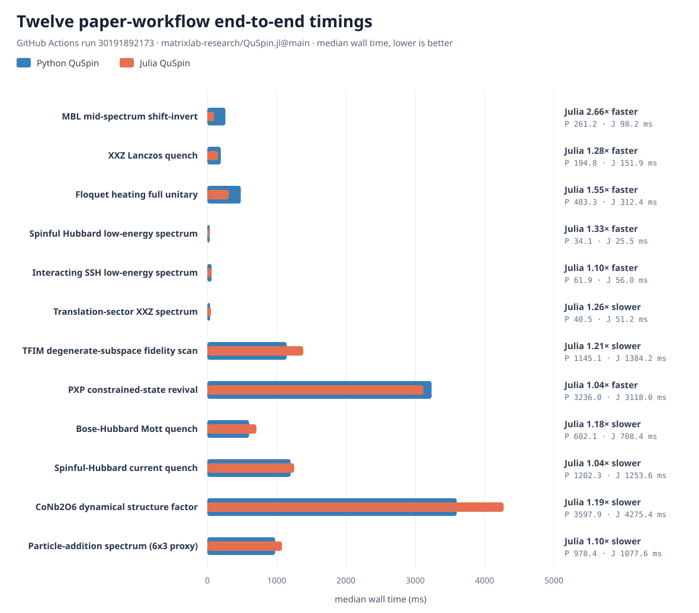

# QMBED Benchmark — public correctness and performance suite

This public repository independently verifies the QMBED simulator family. It
currently contains the original Python-to-Julia QuSpin compatibility campaign,
the Rust QMBED contract and adapter, and literature-derived exact-diagonalization
workflows shared across language implementations.

The `julia-compat-benchmarks` GitHub Actions workflow first regenerates the
reference observations with a pinned Python QuSpin commit. It then installs the
requested Julia candidate ref and runs the public Test.jl conformance suite.
Python is not present in the candidate test job.

```
Project.toml         deps: Test (+ the package under test, added at CI time)
test/runtests.jl     the public conformance suite — ordinary @testset / @test.
                     It delegates to namespace/object files under
                     test/full_api/, which mirror the 64-object migration plan.
test/full_api_migration_plan.json
                     frozen 64-object / 282-method / 180-attribute denominator.
ci/runcandidate.jl   develop + test the package the MR proposes.
.github/workflows/verify.yml
                     first reproduces the pinned Python oracle, then runs the
                     Julia conformance suite against a selected candidate ref.
```

## How a candidate is judged

1. A maintainer dispatches `julia-compat-benchmarks` with the public candidate
   repository and an immutable commit SHA or selected ref.
2. The oracle job installs the pinned Python QuSpin commit, regenerates its
   deterministic observations, and compares them structurally against the
   frozen reference. Keys, shapes, integer values, and strings remain exact;
   floating-point values use a `5e-12` relative/absolute tolerance for
   platform-specific BLAS tails.
3. Only after that passes, the Julia job installs the candidate and runs the
   independent conformance suite with `Pkg.test()`.

Tests, expected values, artifacts, and Actions logs are public. This is an
independent verification repository, not a hidden evaluation gate; its value
comes from keeping the scientific oracle and workflow composition separate
from candidate-package unit tests.

## Timing and performance baselines

Every candidate run produces two public timing artifacts:

1. `verification-timing-*` records every API/integration test file's wall,
   compile, recompile, GC, allocation, and lock-conflict measurements. These
   are cold, ordered verification-suite timings and answer which test files
   dominate CI time.
2. `qmbed-performance-*` compares the pinned Python QuSpin commit with the
   Julia candidate on the same GitHub Actions runner. It covers basis and
   Hamiltonian construction, dense and CSC matrix-vector action, dense and CSC
   Lanczos, CSC ARPACK partial eigenspectra, dense full diagonalization,
   CSR/DIA kernels, physical momentum-sector construction, matrix-free
   operator construction and action, CSC Krylov time evolution, entanglement
   entropy, two-map 2D general-basis construction, higher-spin sparse
   construction, batched time evolution and entropy, spinful sparse
   construction and matrix-free action, sparse ExpOp vector/grid action,
   diagonal-ensemble fluctuations, and fresh-process package load.
   Dense/CSC/CSR/DIA controlled comparisons are reported separately from
   current-backend comparisons.

Operation benchmarks run three warm-ups followed by 15 samples. Each sample is
adaptively batched to target at least 80 ms, and the raw CSV reports minimum,
p05, p25, median, mean, p75, p95, maximum, standard deviation, and iterations
per sample. Fresh-process package loading uses one warm-up and nine new
processes. Julia allocation medians are recorded separately. BLAS, OpenMP, and
Julia are fixed to one thread. The report explicitly lists Python and Julia
storage formats for every row. A preflight runs outside the timed region;
new-API rows assert dimensions, return shapes, matrix fingerprints, or physical
invariants, while legacy rows retain an exception-free smoke check. Native
Julia CSC construction is measured directly against Python CSC construction.
The suite separately asserts the
stored matrix types, sparse ARPACK residuals, and reduced workflows from
published MBL, quantum-quench, and Floquet spin-chain studies.

The completion gate also keeps independent cases for boson, spinless-fermion,
spinful-fermion, and user-defined Hamiltonians; translation/parity/inversion
sector reconstruction; actual CSR/DIA storage; Hermiticity, particle-number,
and symmetry rejection; matrix-free ARPACK residuals; and sparse Krylov
evolution/Floquet unitarity. These cases intentionally use different lattice
sizes and coefficients from the public package tests. Their numerical anchors
come from the pinned Python commit recorded in `oracle/reference.json`.

The performance job is observational: it reports `Python median / Julia
median` but does not fail a candidate on noisy hosted-runner timing. The CSV
artifacts are retained for 90 days. A regression threshold should only be
introduced after enough runs establish runner variance.

### Literature-derived ED coverage

The verification suite also contains 21 end-to-end ED scenarios spanning 13
scientific application areas found in a literature search for
exact-diagonalization workflows. See
[`docs/ED_WORKFLOW_COVERAGE.md`](docs/ED_WORKFLOW_COVERAGE.md) for the model,
observable, integration size, representative paper scale, and explicit
direct/assisted/proxy boundary of every scenario.
An additional [LKM-derived catalog of fifty ED research
applications](docs/LKM_ED_APPLICATION_CATALOG.md) records the next benchmark
horizon across ten domains. It includes 21 beyond-QMBED cases and thirteen
AD-essential workflows, with machine-readable benchmark shapes, validation
criteria, source-family provenance, and capability gaps in
[`benchmark/catalog/lkm_ed_applications.json`](benchmark/catalog/lkm_ed_applications.json).
Catalog membership is not a claim that a case is already executable.
The newer workflow-analysis capabilities use a deliberate package-test/
independent-validation split documented in
[`docs/LKM_WORKFLOW_VALIDATION.md`](docs/LKM_WORKFLOW_VALIDATION.md).
The first paired local paper-scale result is recorded in
[`docs/PAPER_PERFORMANCE_BASELINE.md`](docs/PAPER_PERFORMANCE_BASELINE.md).

Small Julia workflow timings run on every candidate performance job after a
correctness preflight. Select `benchmark_tier=paper` in the manual workflow to
add twelve paired, paper-shaped Python QuSpin vs Julia measurements. Paper
workflows use lazy per-case construction, one warm-up, five samples, physical
residual/norm/unitarity checks, and preserve raw samples in the uploaded CSV.
They are observational performance evidence rather than a noisy hosted-runner
pass/fail gate.

### Test provenance

The verification inputs have three distinct sources:

1. The API denominator is the frozen
   [64-object migration plan](test/full_api_migration_plan.json) extracted from
   the Python QuSpin surface used for this campaign.
2. Numerical oracle values are regenerated from the pinned upstream
   [QuSpin commit `5bf9e5b`](https://github.com/QuSpin/QuSpin/commit/5bf9e5b266e6d8b70e5cf5973c7c7d59d62e412f)
   and compared with [`oracle/reference.json`](oracle/reference.json).
3. Scientific scenarios were selected from a literature search over common
   exact-diagonalization applications on 2026-07-20. LKM was used as a paper
   index during that search, not as a scientific citation or runtime
   dependency. The resulting 21 deterministic integration cases and their
   direct/assisted/proxy boundaries are listed in
   [`docs/ED_WORKFLOW_COVERAGE.md`](docs/ED_WORKFLOW_COVERAGE.md).

The twelve timed `paper`-tier workflows are larger paired Python/Julia instances
of that catalog. The paper links below were rechecked against the LKM
literature index on 2026-07-21. A citation means that the paper supplies the
physical model or numerical method represented by the benchmark; it does not
mean that this repository reproduces the paper's parameters or results.

| Timed workflow | Literature and method source | Relationship to this benchmark |
|---|---|---|
| MBL mid-spectrum shift-invert | [*Shift-invert diagonalization of large many-body localizing spin chains*](https://doi.org/10.21468/SciPostPhys.5.5.045) | Direct method/model anchor: random-field Heisenberg chain, fixed magnetization, and interior eigenpairs obtained with shift-invert. |
| XXZ Lanczos quench | [*Relaxation of Antiferromagnetic Order in Spin-1/2 Chains Following a Quantum Quench*](https://doi.org/10.1103/PhysRevLett.102.130603); [*QuSpin part I*](https://doi.org/10.21468/SciPostPhys.2.1.003) | The first paper anchors the Néel-state XXZ quench; the QuSpin paper anchors the ED/time-evolution implementation. The benchmark uses a deterministic Lanczos propagation instance. |
| Floquet full-unitary heating | [*Long-time Behavior of Isolated Periodically Driven Interacting Lattice Systems*](https://doi.org/10.1103/PhysRevX.4.041048); [*QuSpin part I*](https://doi.org/10.21468/SciPostPhys.2.1.003) | Sudden-quench Floquet heating and the driven transverse-field Ising example motivate the two-step unitary, quasienergy, and unitarity checks. |
| Spinful Hubbard spectrum | [*QuSpin part II: bosons, fermions and higher spins*](https://doi.org/10.21468/SciPostPhys.7.2.020) | Direct package-method anchor for spinful-fermion ED. The clean, half-filled `L=8` Hubbard spectrum is a benchmark constructed in this repository, not a reproduction of one paper. |
| Interacting SSH spectrum | [*Topological phase transitions, Majorana modes, and quantum simulation of the Su-Schrieffer-Heeger model with nearest-neighbor interactions*](https://doi.org/10.1103/PhysRevB.101.045422); [*QuSpin part II*](https://doi.org/10.21468/SciPostPhys.7.2.020) | Direct model anchor for a half-filled SSH chain with nearest-neighbor interaction and ED; QuSpin part II supplies the fermion/SSH implementation context. |
| Translation-sector XXZ spectrum | [*QuSpin part I*](https://doi.org/10.21468/SciPostPhys.2.1.003); [*The ALPS project release 1.3*](https://doi.org/10.1016/j.jmmm.2006.10.304) | The sources anchor symmetry-resolved XXZ ED and translation reduction into momentum sectors. The `L=18`, `k=0` instance is defined by this benchmark. |
| TFIM degenerate-subspace fidelity scan | [*Automatic differentiation of dominant eigensolver and its applications in quantum physics*](https://doi.org/10.1103/PhysRevB.101.245139) | The paper computes 1D TFIM fidelity susceptibility by ED through `N=20`. The benchmark uses `L=16`, five fields across `g=1`, and a two-state subspace fidelity so near-degeneracy is treated gauge-invariantly. |
| PXP constrained-state revival | [*Scar-induced imbalance in staggered Rydberg ladders*](https://doi.org/10.48550/arXiv.2411.02500) | The paper reports PXP revivals through `N=28` and a revival period near `4.8`. The benchmark uses periodic `L=24` (constrained dimension 103682), the staggered state, and five times through two revival periods. |
| Bose–Hubbard Mott quench | [*Equilibration and prethermalization in the Bose-Hubbard and Fermi-Hubbard models*](https://doi.org/10.1103/PhysRevA.89.033616) | The paper compares its strong-coupling treatment with ED on an 11-site 1D lattice. The benchmark uses that `L=11`, unit filling, `sps=3`, and `J/U=0.1`. |
| Spinful-Hubbard current quench | [*Electron-light interaction in nonequilibrium — exact diagonalization for time dependent Hubbard Hamiltonians*](https://doi.org/10.48550/arXiv.2005.13498) | The method supports time-dependent Hubbard ED through 14 sites. The benchmark uses half-filled `L=10`, `U/t=8`, a bias-release quench, Krylov propagation, and the center-bond current. |
| CoNb2O6 dynamical structure factor | [*“Quasiparticle breakdown” in the quasi-one-dimensional Ising ferromagnet CoNb2O6*](https://doi.org/10.48550/arXiv.1407.2794) | The paper uses full ED through `L=16` and larger continued-fraction calculations. The benchmark uses `L=16`, its fitted dimensionless couplings at `B=7 T`, a staggered spin source, and a 100-step Lanczos spectrum. |
| Particle-addition spectrum (`6×3` proxy) | [*Particle spectral functions for fractional quantum anomalous Hall states*](https://doi.org/10.48550/arXiv.2410.07319) | The paper evaluates a projected-Chern-band spectrum on `6×4`. The CI benchmark deliberately reduces to a `6×3` interacting triangular lattice and tests only the shared `N=6→7` sector shift and Krylov spectral kernel; it is not an FQAH reproduction. |

These are **paper-shaped workflow benchmarks**, not complete paper
reproductions and not timings copied from the papers. Lattice sizes,
coefficients, solver tolerances, and correctness preflights are deterministic
benchmark choices defined in
[`python_paper_workflow_benchmarks.py`](benchmark/python_paper_workflow_benchmarks.py)
and
[`julia_paper_workflow_benchmarks.jl`](benchmark/julia_paper_workflow_benchmarks.jl).

The first six rows preserve the original general QuSpin workflow baseline. The
last six are the literature-derived medium-size extension and exercise the new
workflow-analysis APIs. Basis construction, Hamiltonian assembly, solver, and
observable are timed end to end.

### Rust candidate preparation

The repository also carries a Rust-first verification contract in
[`rust/`](rust/). It does not mechanically translate Julia syntax. The proposed
public API is built around typed bases, reusable operator terms, universal
Hamiltonian assembly, and a shared stored/matrix-free `LinearOperator` boundary.
The exact twelve paper workflows, their parameters, physical invariants, and
the benchmark CSV protocol are mirrored in a small compilable Rust crate.

The public Rust candidate now connects through a public verification adapter pinned to an
immutable commit. Release CI executes all twelve paper workflows and validates
their physical invariants; the original and structure-aware five-sample local
records are retained under [`rust/benchmarks`](rust/benchmarks/). The current
record documents a 1.85× geometric-mean end-to-end speedup from the complete
candidate, including a capability-selected real shift-invert backend and no
workflow-specific dispatch. A `paper`-tier run now executes Python, Julia, and
Rust sequentially on the same hosted runner, requires every physical invariant
to pass, and uploads both the twelve per-workflow timing CSVs and whole-suite
peak-RSS records. See
[`docs/RUST_API_CONTRACT.md`](docs/RUST_API_CONTRACT.md) for the API proposal and
Julia-to-Rust migration map.

The accepted first-stage task documents stay frozen. Preparation for the
complete package is maintained separately under [`rust/full-taskdoc/`](rust/full-taskdoc/):
the scientific motivation, a Rust-native contract mapping all 64 frozen Python
objects, and the package/conformance/workflow/scale gates required before full
parity can be claimed.

### Latest twelve-workflow timing chart

The overlaid bar chart below is updated automatically after a successful
`paper`-tier run dispatched from `main`. Each workflow shares one baseline: the
wider blue bar is Python QuSpin and the narrower orange bar is the selected
Julia candidate. The right-hand annotation reports whether Julia is faster,
slower, or at parity, together with both same-runner median wall times; lower is
better. PR and non-`main` runs still upload the SVG as an Actions artifact but
do not rewrite this README snapshot.



## Extending the suite

Each namespace has a directory under `test/full_api/`; add one file per public
object or tightly coupled helper family, then include it from `test/runtests.jl`.
The committed independent goldens are a floor, not a ceiling: add randomized
property checks and real multi-call integration tests.
`ci/check_full_api_plan.py` prevents the source denominator from silently
shrinking.

Some frozen task documents and historical benchmark records retain the terms
`QuSpin.rs`, `private`, or `held_out` because they record the provenance and
clean-room boundary of earlier campaigns. They do not describe this
repository's current visibility: **QMBED Benchmark and its CI are public**.
